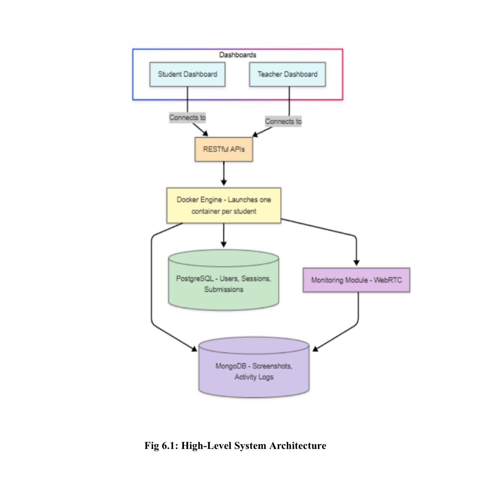
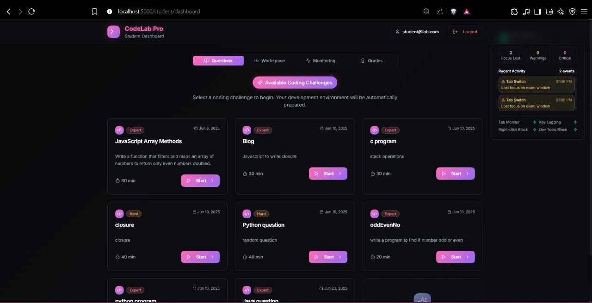
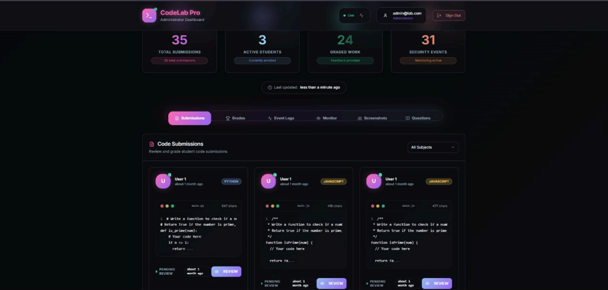
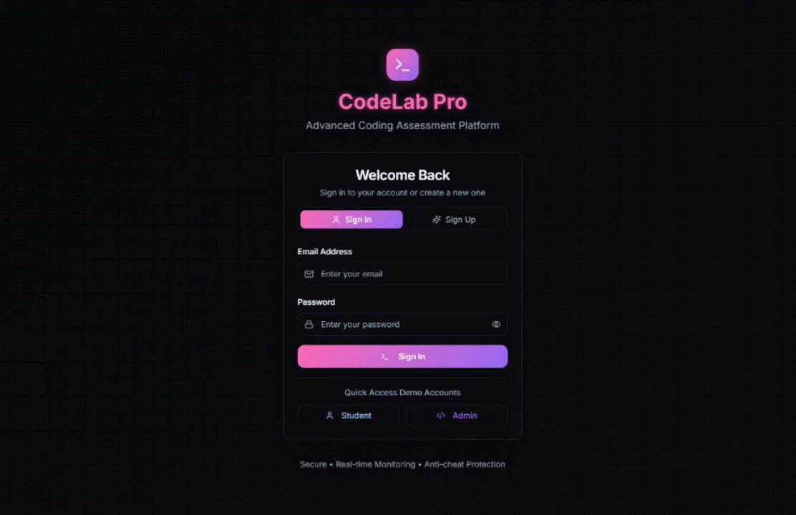

# College Lab Tracker  
*A Web-Based Codespace & Monitoring System for Secure Remote Coding Labs*

<p align="center">
  
  
  
  
  
</p>

---

## 📌 Overview  
**College Lab Tracker** is a **full-stack, containerized platform** designed for educational institutions to conduct **secure, monitored programming assessments** in remote/hybrid settings.  
It uses **Docker-based isolated coding environments** and **Puppeteer-based interval monitoring** to ensure academic integrity while reducing the administrative load for educators.

---

## ✨ Features  
### 🔹 Secure Containerized Environments  
- Individual **Docker containers** per student for **Java, Python, C++, JavaScript**.  
- Session-specific, non-reusable workspaces.  

### 🔹 Interval-Based Monitoring  
- **Puppeteer** captures screenshots every 60 seconds.  
- Screenshots stored securely in **MongoDB** with timestamps & session IDs.  

### 🔹 Dual-Database Architecture  
- **PostgreSQL** for structured data (users, submissions, grades).  
- **MongoDB** for unstructured monitoring data (screenshots, logs).  

### 🔹 Role-Based Dashboards  
- **Student Dashboard**: IDE access, submission tools, session timer.  
- **Admin Dashboard**: Session control, screenshot review, grading tools.  

---

## 🛠 Tech Stack  
| Layer            | Technologies |
|------------------|--------------|
| **Frontend**     | React.js (Vite, TypeScript), Tailwind CSS |
| **Backend**      | Node.js (Express, TypeScript) / FastAPI |
| **Databases**    | PostgreSQL, MongoDB |
| **Containerization** | Docker |
| **Monitoring**   | Puppeteer |
| **Deployment**   | NGINX, GitHub, CI/CD |

---

## 🏗 Architecture  
<p align="center">
  <a href="docs/architecture.jpeg">
    
  </a>
</p>

---

## 📂 Project Structure  
```plaintext
College-Lab-Tracker/
├── frontend/           # React + Vite + Tailwind UI
├── backend/            # Node.js / FastAPI APIs
├── docker/             # Container images & orchestration
├── scripts/            # Puppeteer monitoring scripts
└── docs/               # Documentation & setup guides
📸 Demo  
<p align="center">
  
  
  
</p>

🔐 Security & Integrity Measures
RBAC – Role-Based Access Control
JWT-secured sessions
Sandboxed container execution (no internet access)
Tamper-proof logs & submissions
📈 Future Enhancements
WebRTC-based real-time monitoring (live screen sharing)
AI-based plagiarism detection
Facial recognition identity verification
LMS integration (Moodle, Google Classroom)
Analytics dashboards & heatmaps
👩‍💻 Team
Hoor Parvaiz – Backend & Security Engineer
Ishika Mohol – DevOps & UI Developer
Rifah Balquees – Frontend Developer
Shrinidhi Pawar – System Designer & Database Admin
📜 License
This project is intended for academic use under institutional guidelines.
